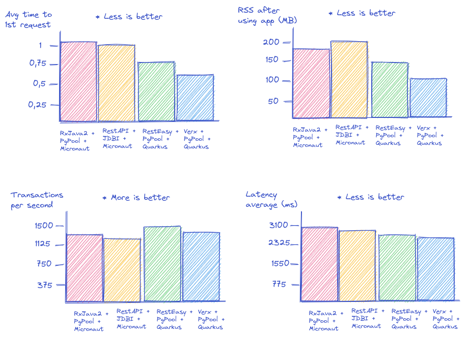
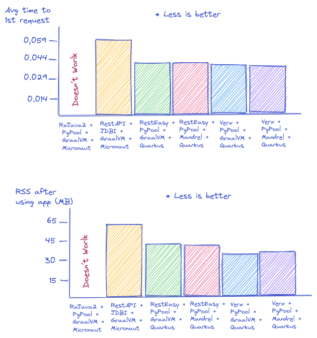
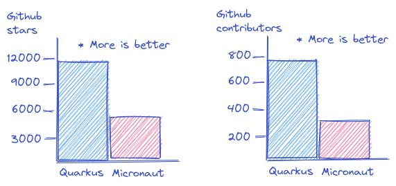

# Micronaut Vs Quarkus

We are going to compare Micronaut and Quarkus frameworks by running a simple scenario and getting some telemetry data such as 'Avg time to 1st request', 'resident set size (RSS)' and 'transactions per second'. 

## Environment

JVM: Temurin 17.0.5

Native: GraalVM 22.3.1 Java 17 CE / Mandrel 22.3 Java 17

Arch: AMD 5950X (16 cores) 64Gb RAM

OS: Linux / Fedora 37 

## Requirements

- Java 17
- Docker
- python 3
- Locust

## Scenario

Given an endpoint `http://localhost:8080/postgres` retrieve the postgres version and return it as a String.

Postgres will be up and running in Docker:

```
docker run --name some-postgres -e POSTGRES_PASSWORD=topsecret -e POSTGRES_USER=user -e POSTGRES_DB=mydb -p 5432:5432 -d postgres:14
```

## Scripts

* 1strequest.sh: calculate the RSS and Avg time to 1st req.
	* Generate and run a final Jar or binary
	* Run the script, for example: `./1strequest.sh "java -jar {ROOT_PROJECT_FOLDER}/build/quarkus-app/quarkus-run.jar" 30`
*  postgresIT.py: this is a performance testing script (locust script)
	* Generate and run a final Jar or binary
	* Run the script, for example: `locust  -f postgresIT.py`
	* Configure your scenario params on `http://localhost:8089`

## Results

### JVM


| Metric        | Avg time to 1st req | RSS after using app (MB) | TPS   | Request Amount | Fails | Latency average (ms) |
| ------------- | ------------------- | ------------------------ | ----- | -------------- | ----- | -------------------- |
| Verx + PgPool  + Quarkus 2.16.5.Final  | 0.678 sec  | 127.3 MB | 1381.12 | 229638 | 0 | 2795|
| RestEasy + PgPool + Quarkus 2.16.5.Final  | 0.792 sec  | 145.4 MB | 1400.63 | 238726 | 0 | 2870|
| RxJava2 + PgPool + Micronaut 3.8.7  | 1.023 sec  | 182.9 MB | 1359.63 | 232340 | 0 | 3070|
| RestAPI + JDBI + Micronaut 3.8.7  | 1.008 sec  | 192.7 MB | 1340.33 | 227549 | 0 | 2980|

> **_TPS_** was calculated based on locus metrics. The scenario run 10K concurrent request, dispatched every 1 - 2 sec





### Native

| Metric        | Avg time to 1st req | RSS after using app (MB) | 
| ------------- | ------------------- | ------------------------ | 
| Verx + PgPool + Mandrel 22.3 java17 + Quarkus 2.16.5.Final  | 0.040 sec  | 40.8 MB |
| Verx + PgPool + GraalVM 22.3 + Quarkus 2.16.5.Final  | 0.041 sec  | 39.6 MB |
| RestEasy + PgPool + Mandrel 22.3 java17 + Quarkus 2.16.5.Final  | 0.042 sec  | 41.4 MB |
| RestEasy + PgPool + GraalVM 22.3 + Quarkus 2.16.5.Final  | 0.042 sec  | 41.3 MB |
| RxJava2 + PgPool + GraalVM 22.3 + Micronaut 3.8.7  | Doesn´t Work  | Doesn´t Work |
| RestAPI + JDBI + GraalVM 22.3 + Micronaut 3.8.7  | 0.059 sec  | 60.8 MB |



## Developer Experience

|               | Micronaut           |           Quarkus        | 
| ------------- | ------------------- | ------------------------ | 
| Dev Services  | &#9746; | &#9745; |
| Dev UI | &#9746; | &#9745; |
| Dev Mode      | &#9745; | &#9745; |
| Test Mode | &#9746; |  &#9745; |
| GraalVM support | &#9745; | &#9745; |
| Mandrel support | &#9746; | &#9745; |
| K8s native support | &#9745; | &#9745; |
| Knative support | &#9745; | &#9745; |
| K8s operator support | &#9746; | &#9745; |
| OCP native support | &#9746; | &#9745; |

## Community adoption



Is true that Micronaut is not a monorepo perse, so some stars could be located in external repos as micronaut data or security, but even taking into account this sub-projects is not enough to fill the gap. Also, Quarkus is a monorepo but there are a lot of community extensions that are not located in this repo (are located in quarkiverse, as Quarkus Helm extension or HiveMQ extension). To me what make me my attention, is that Micronaut was released one year earlier than Quarkus, but the adoption KPIs doesn´t show this theorical advantage.    

